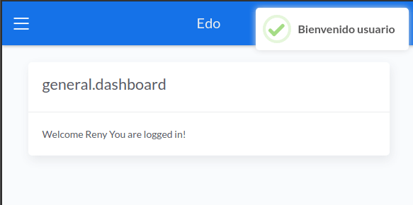
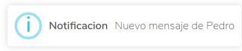

# Instalación

Via Composer

``` bash
$ composer require desolatormagno/laravel-msg
```

Publicar

``` bash
$ php artisan vendor:publish --tag=laravel-msg
```

# Utilización

## Back

``` php
use DesolatorMagno\LaravelMsg\Message as Msg;
.
.
.
Msg::success('Bienvenido usuario');

Msg::success('Acción Exitosa', "El mensaje fue enviado a $usuario");
```

Incluir el archivo de mensaje al inicio del controlador o archivo en el que se desea utilizar luego utilizar la clase para llamar dinamicamente a una de las funciones que provee el paquete según el estilo visual que se desee mostrar, pasando por parámetro el mensaje a mostrar.

### Métodos

- success
- info
- question
- warning
- error

## Front

``` php
@include('laravel-msg.message')

@stack('script')
```
Desde el front solo es necesario incluir el archivo **message.php** el cual esta ubicado en **views/laravel-msg**, y agregar un stack de **script** en el template base para que se muestre el mensaje satisfactoriamente.

## Funcionamiento

Paquete muy sencillo el cual utiliza la librería de SweetAlert2 mas una clase de php para mostrar mensajes informativos al usuario de diferentes estatus, tanto el mensaje, titulo y el estilo del mensaje es configurable, pero todas las demás configuraciones son hardcoded para todos los mensajes.

El titulo del mensaje es opcional, como se puede apreciar a continuación.

Como se ve en una web real.



Ejemplo de un mensaje de acción satisfactoria

``` php
Msg::success('Bienvenido usuario');
```


Ejemplo de un mensaje de error o mensaje de acción destructiva.

``` php
Msg::error('Usuario eliminado');
```


Ejemplo de un mensaje de informativo con titulo y mensaje.

``` php
Msg::info('Notificacion', "Nuevo mensaje de Pedro");
```

